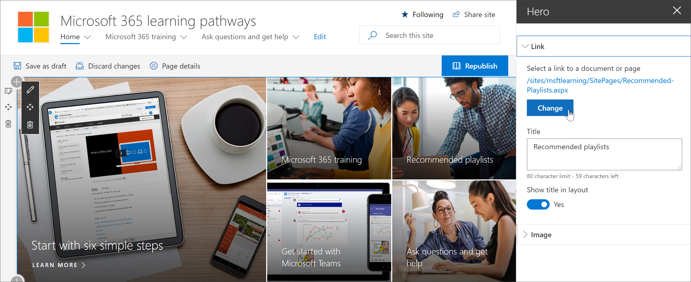

# Link para conteúdo de cursores de aprendizadoLink to learning pathways content

Com os caminhos de aprendizado, há duas maneiras de vincular ao conteúdo:With learning pathways, there are two ways to link to content:

- Link para a página que hospeda a Web Part filtrada para o conteúdo que você deseja exibirLink to the page that host the Web part filtered for the content you want to display 
- Vincular diretamente a uma instância da Web PartLink directly to an instance of the Web part

## Link para uma páginaLink to a page

Se você criou novas experiências de páginas e aprendizado com a Web Part de cursores de aprendizado da Microsoft 365, você pode vincular à página com a Web Part configurada para mostrar o conteúdo que você deseja exibir.If you've created new pages and learning experiences with the Microsoft 365 learning pathways web part, you can link to the page with the Web part configured to show the content you want to display. Na seção anterior, abordamos como exibir as playlists do Excel em uma página.In the previous section, we covered how to display Excel playlists on a page. Agora você pode editar a Home Page para vincular à página.You could now edit the Home page to link to the page. 

1. Na Home Page, clique em **Editar**.From the Home page, click **Edit**.
2. Clique em **Editar detalhes** em um dos blocos de página inicial.Click **Edit details** in one of the Home page tiles. Neste exemplo, editamos os blocos de **playlist recomendados** .In this example, we edit the **Recommended playlists** tiles.
3. Em **link**, clique em **alterar**.Under **Link**, click **Change**.

4. Clique em **site**, em **páginas do site**, clique na página à qual deseja vincular e, em seguida, clique em **abrir**.Click **Site**, then **Site Pages**, click the page you want to link to, and then click **Open**. Neste exemplo, o link para a página **Create-Your-Own-Experience. aspx** abordada na seção anterior.In this example, we link to the **Create-your-own-experience.aspx** page covered in the previous section.
5. Feche o painel Propriedades do herói, clique em **publicar**e, em seguida, teste o link.Close the Hero properties pane, click **Publish**, and then test the link. 

## Link para a Web Part de cursores de aprendizado da Microsoft 365Link to the Microsoft 365 learning pathways web part
Os caminhos de aprendizado fornecem a você, o administrador ou um usuário final, a capacidade de vincular a uma instância da Web Part independente da página que contém a Web Part.Learning pathways gives you, the administrator, or an end-user, the ability to link to an instance of the Web part independent of the page that contains the Web part. Você pode compartilhar o link copiado ou vinculá-lo a partir de outras páginas.You can share the copied link or link to it from other pages. O link copiado, quando clicado, mostra a instância de Web Part de cursores de aprendizado da Microsoft 365 na página CustomLLearningViewer. aspx.The copied link, when clicked, shows the Microsoft 365 learning pathways web part instance in the CustomLLearningViewer.aspx page. Vejamos um exemplo.Let's look at an example. 

1. Na Home Page, clique em **treinamento Microsoft365**.From the Home page, click **Microsoft365 training**.
2. Clique em **Microsoft Teams**e, em seguida, clique em **introdução ao Microsoft Teams**.Click **Microsoft Teams**, and then click **Intro to Microsoft Teams**.
3. Clique no ícone de **cópia** .Click the **Copy** icon.

4. Clique em página inicial no menu do site de cursores de aprendizado da Microsoft 365.Click Home from the Microsoft 365 learning pathways site menu.
5. Cole a URL copiada na barra de endereços do navegador e pressione ENTER.Paste the copied URL in the address bar of the browser and press ENTER. 

Conforme mostrado na ilustração a seguir, o link vai para a página CustomLearningViewer. aspx e exibe o conteúdo com base nos parâmetros do link copiado.As shown in the following illustration, the link goes to the CustomLearningViewer.aspx page and displays the content based on the parameters in the copied link. 

